# GitLab AI代码审查系统流程图

## 系统架构概览

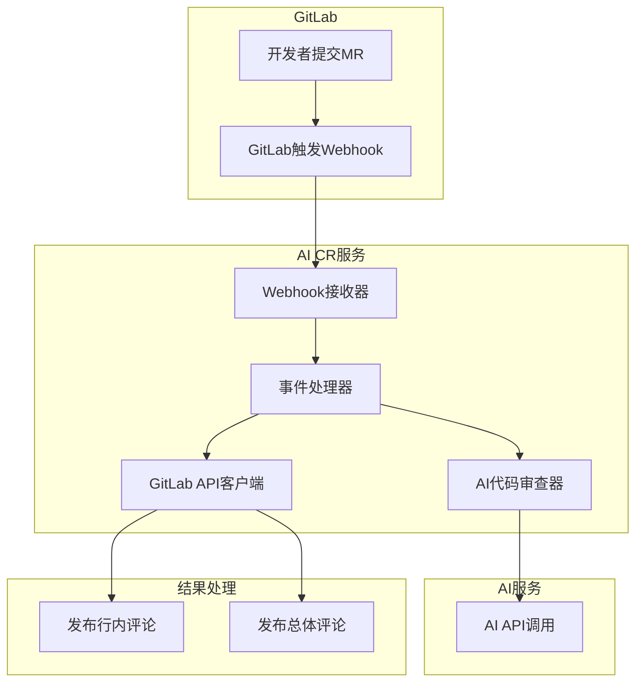

## 详细流程图

### 1. Webhook接收与路由

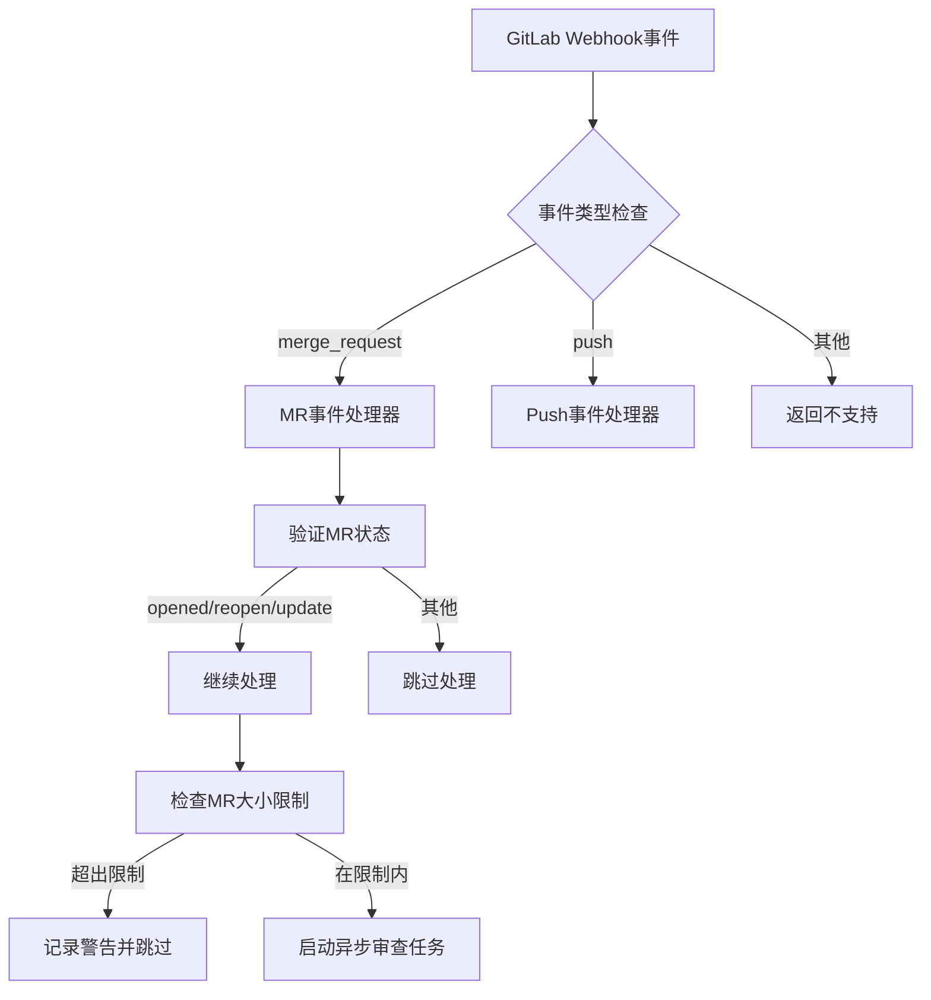

### 2. MR大小限制检查

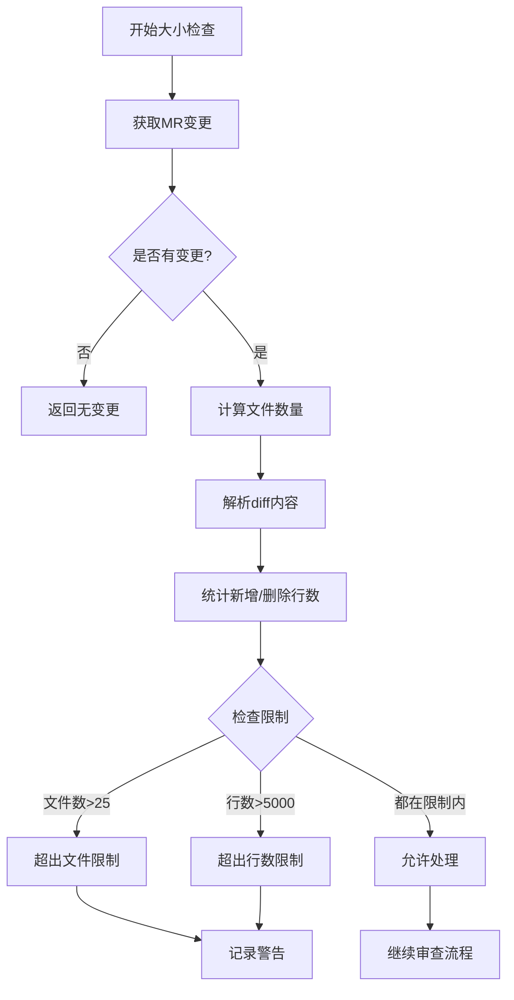

### 3. 异步代码审查任务

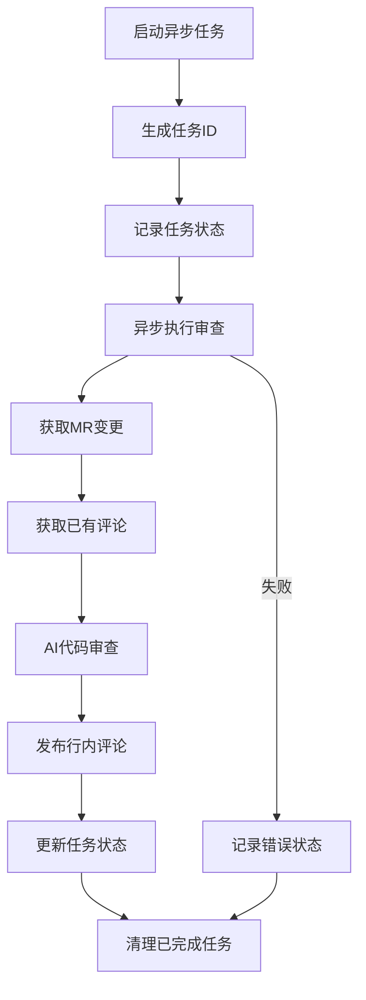

### 4. AI代码审查核心流程

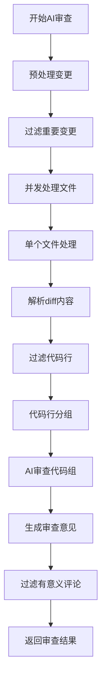

### 5. 代码行处理详细流程

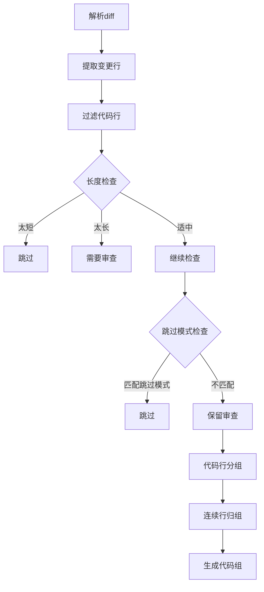

### 6. AI审查提示词生成

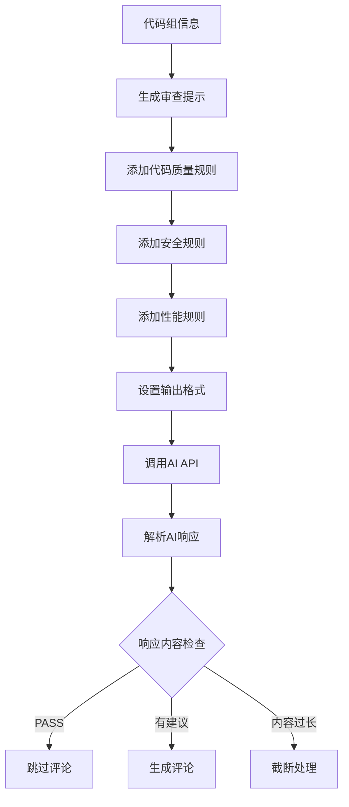

### 7. 评论发布流程

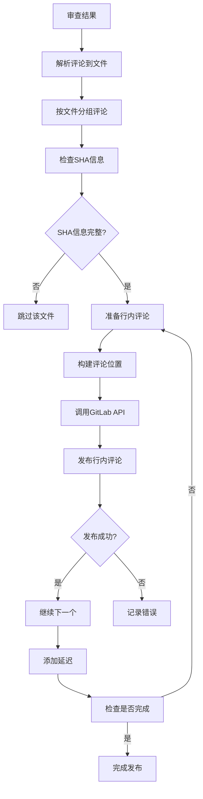

### 8. 错误处理与重试机制

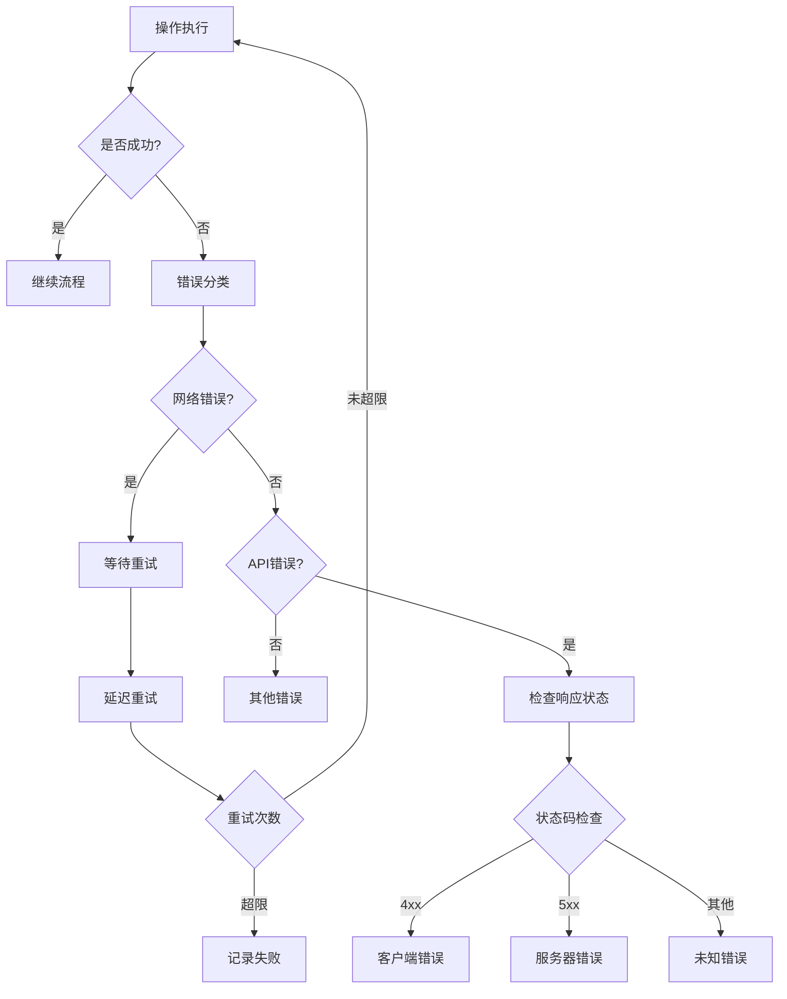

### 9. 任务状态管理

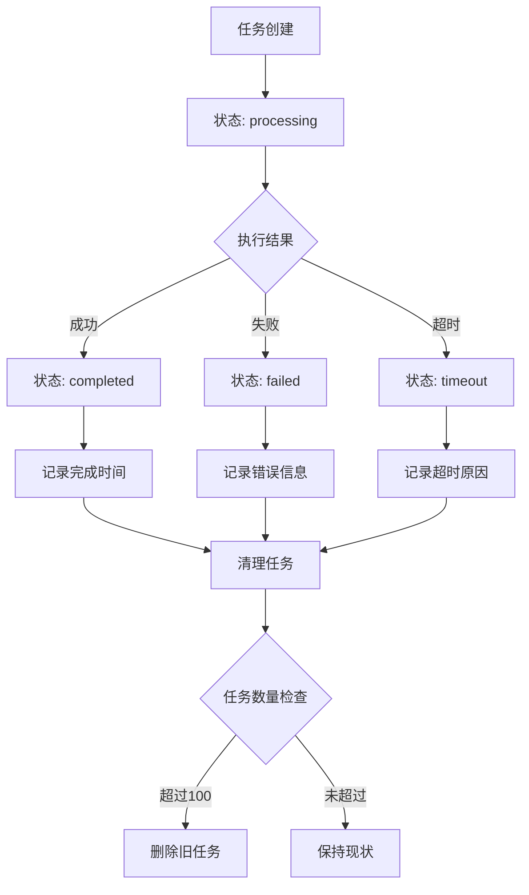

### 10. 系统监控与日志

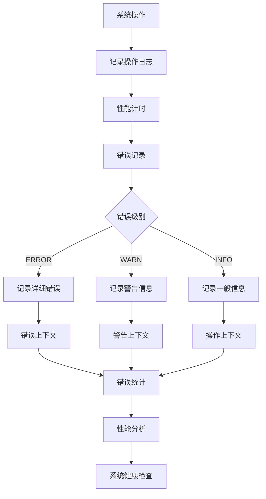

## 关键配置参数

| 参数                   | 默认值 | 说明               |
| ---------------------- | ------ | ------------------ |
| `MAX_FILES_CONCURRENT` | 5      | 并发处理文件数     |
| `MAX_GROUPS_PER_BATCH` | 15     | 每批处理代码组数   |
| `MAX_LINES_PER_GROUP`  | 40     | 每组最大代码行数   |
| `AI_REQUEST_TIMEOUT`   | 6000ms | AI API请求超时     |
| `MAX_CONCURRENT_AI`    | 3      | 并发AI请求数       |
| `MR_MAX_FILES`         | 25     | MR最大文件数限制   |
| `MR_MAX_LINES`         | 5000   | MR最大代码行数限制 |

## 性能优化策略

1. **异步处理**: 所有代码审查任务异步执行，不阻塞webhook响应
2. **并发控制**: 限制并发文件处理和AI请求数量，避免资源耗尽
3. **批量处理**: 将代码组批量发送给AI，减少API调用次数
4. **智能过滤**: 预过滤明显不需要审查的代码，减少AI调用
5. **缓存机制**: 缓存审查结果，避免重复审查相同代码
6. **任务管理**: 自动清理已完成任务，维护系统性能

## 安全考虑

1. **输入验证**: 验证所有webhook事件和API参数
2. **权限控制**: 使用GitLab Bot Token进行API访问
3. **敏感信息**: 避免在日志中记录敏感信息
4. **错误处理**: 不暴露内部错误信息给外部
5. **超时控制**: 设置合理的API超时时间，防止资源耗尽

这个流程图详细展示了GitLab AI代码审查系统的完整工作流程，从webhook接收到评论发布的每个环节都有清晰的说明。
